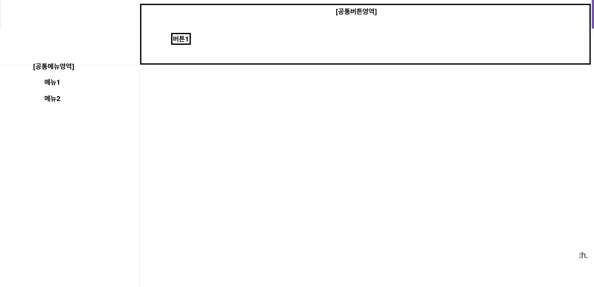

Chapter1 들어가기에 앞서...
==================================================================================

## 지저분해지는 코드



- 위와 같은 UI를 갖는 클라이언트 프로그램을 개발한다고 했을 때, 아래와 같이 코드를 작성할 수 있다.
```java
public class Application implements OnClickListener {
    private Menu menu1 = new Menu("menu1");
    private Menu menu2 = new Menu("menu2");
    private Button button1 = new Button("button1");

    private String currentMenu = null;

    public Application() {
        menu1.setOnClickListener(this);
        menu2.setOnClickListener(this);
        button1.setOnClickListener(this);
    }

    public void clicked(Component eventSource) {
        if (eventSource.getId().equals("menu1")) {
            changeUIToMenu1();
        } else if (eventSource.getId().equals("menu2")) {
            changeUIToMenu2();
        } else if (eventSource.getId().equals("button1")) {
            if(currentMenu == null) {
                return;
            }
            if(currentMenu.equals("menu1")) {
                processButton1WhenMenu1();
            } else if (currentMenu.equals("menu2")) {
                processButton1WhenMenu2();
            }
        }
    }

    private void changeUIToMenu1() {
        currentMenu - "menu1";
        System.out.println("메뉴1 화면으로 전환");
    }

    private void changeUIToMenu2() {
        currentMenu - "menu2";
        System.out.println("메뉴2 화면으로 전환");
    }

    private void processButton1WhenMenu1() {
        System.out.println("메뉴1 화면의 버튼1 처리");
    }

    private void processButton1WhenMenu2() {
        System.out.println("메뉴2 화면의 버튼1 처리");
    }
}
```

- 위 코드에서 버튼2가 추가된다면?
```java
public class Application implements OnClickListener {
    private Menu menu1 = new Menu("menu1");
    private Menu menu2 = new Menu("menu2");
    private Button button1 = new Button("button1");
    private Button button2 = new Button("button2");  // 추가

    private String currentMenu = null;

    public Application() {
        menu1.setOnClickListener(this);
        menu2.setOnClickListener(this);
        button1.setOnClickListener(this);
        button2.setOnClickListener(this); // 추가
    }

    public void clicked(Component eventSource) {
        if (eventSource.getId().equals("menu1")) {
            changeUIToMenu1();
        } else if (eventSource.getId().equals("menu2")) {
            changeUIToMenu2();
        } else if (eventSource.getId().equals("button1")) {
            if(currentMenu == null) {
                return;
            }
            if(currentMenu.equals("menu1")) {
                processButton1WhenMenu1();
            } else if (currentMenu.equals("menu2")) {
                processButton1WhenMenu2();
            }
        } else if (eventSource.getId().equals("button1")) {
            if(currentMenu == null) {
                return;
            }
            if(currentMenu.equals("menu1")) {
                processButton1WhenMenu1();
            } else if (currentMenu.equals("menu2")) {
                processButton1WhenMenu2();
            }
        } else if (eventSource.getId().equals("button2")) {   // 추가
            if(currentMenu == null) {
                return;
            }
            if(currentMenu.equals("menu1")) {
                processButton2WhenMenu1();
            } else if (currentMenu.equals("menu2")) {
                processButton2WhenMenu2();
            }
        }
    }

    .
    .
    .

    // processButton2WhenMenu1 추가
    // processButton2WhenMenu2 추가
}
```

- 만약 메뉴가 5개로 늘어난다면? 상상이 가시죠? 저는 위의 예제를 보고 많이 부끄러웠습니다. 왜냐하면 제가 짜고 있는 코드가 위와 같기 때문입니다.

- 책에서는 위의 상황을 수정하기 좋은 구조를 가진 코드 즉, 객체 지향의 방식으로 풀어보면 아래와 같이 설계할 수 있다고 합니다.

## 수정하기 좋은 구조를 가진 코드
1. 최초의 코드에서 공통적인 부분을 뽑아내보자.
    - 메뉴가 선택되면 해당 화면을 보여준다.
    - 버튼1을 클릭하면 선택된 메뉴화면에서 알맞은 처리를 한다.
```java
public interface ScreenUI {
    public void show();
    public void handleButton1Click();
}
```
2. ScreenUI를 기반으로 메뉴1과 메뉴2를 구현해보자
```java
public class  Menu1ScreenUI implements ScreenUI {
    public void show() {
        System.out.println("메뉴1 화면으로 전환");
    }
    public void handleButton1Click() {
        System.out.println("메뉴1 화면의 버튼1 처리");
    }
}

public class  Menu2ScreenUI implements ScreenUI {
    public void show() {
        System.out.println("메뉴2 화면으로 전환");
    }
    public void handleButton1Click() {
        System.out.println("메뉴2 화면의 버튼1 처리");
    }
}
```
3. 이제 Application 을 구현해보자
```java
public class Application implements OnClickListener {
    private Menu menu1 = new Menu("menu1");
    private Menu menu2 = new Menu("menu2");
    private Button button1 = new Button("button1");

    private ScreenUI currentScreen = null;

    public Application() {
        menu1.setOnClickListener(this);
        menu2.setOnClickListener(this);
        button1.setOnClickListener(this);
    }

    public void clicked(Component eventSource) {
        String sourceId = eventSource.getId();
        if (sourceId.equals("menu1")) {
            currentScreen = new Menu1ScreenUI();
            currentScreen.show();
        } else if (sourceId.equals("menu2")) {
            currentScreen = new Menu2ScreenUI();
            currentScreen.show();
        } else if (sourceId.equals("button1")) {
            if(currentMenu == null)
                return;
            currentScreen.handleButton1Click();
        }
    }
}
```
4. 메뉴/버튼 이벤트 처리 구분하자.
```java
public class Application {
    private Menu menu1 = new Menu("menu1");
    private Menu menu2 = new Menu("menu2");
    private Button button1 = new Button("button1");

    private ScreenUI currentScreen = null;

    public Application() {
        menu1.setOnClickListener(menuListener);
        menu2.setOnClickListener(menuListener);
        button1.setOnClickListener(buttonListener);
    }

    private OnClickListener menuListener = new OnClickListenr() {
        public void clicked(Component eventSource) {
            String sourceId = eventSource.getId();
            if (sourceId.equals("menu1")) {
                currentScreen = new Menu1ScreenUI();
            } else if (sourceId.equals("menu2")) {
                currentScreen = new Menu2ScreenUI();
            }
            currentScreen.show();
        }
    };

    private OnClickListener buttonListener = new OnClickListenr() {
        public void clicked(Component eventSource) {
            if(currentMenu == null)
                return;
            String sourceId = eventSource.getId();
            if (sourceId.equals("button1")) {
                currentScreen.handleButton1Click();
            }
        }
    }; 
}
```
5. 버튼2를 추가해야한다면?
```java
public interface ScreenUI {
    public void show();
    public void handleButton1Click();
    // 추가
    public void handleButton2Click();
}
```
```java
public class  Menu1ScreenUI implements ScreenUI {
    public void show() {
        System.out.println("메뉴1 화면으로 전환");
    }
    public void handleButton1Click() {
        System.out.println("메뉴1 화면의 버튼1 처리");
    }
    // 추가
    public void handleButton2Click() {
        System.out.println("메뉴1 화면의 버튼2 처리");
    }
}

public class  Menu2ScreenUI implements ScreenUI {
    public void show() {
        System.out.println("메뉴2 화면으로 전환");
    }
    public void handleButton1Click() {
        System.out.println("메뉴2 화면의 버튼1 처리");
    }
    // 추가
    public void handleButton2Click() {
        System.out.println("메뉴2 화면의 버튼2 처리");
    }
}
```
```java
public class Application {
    private Menu menu1 = new Menu("menu1");
    private Menu menu2 = new Menu("menu2");
    private Button button1 = new Button("button1");

    private ScreenUI currentScreen = null;

    public Application() {
        menu1.setOnClickListener(menuListener);
        menu2.setOnClickListener(menuListener);
        button1.setOnClickListener(buttonListener);
    }

    private OnClickListener menuListener = new OnClickListenr() {
        public void clicked(Component eventSource) {
            String sourceId = eventSource.getId();
            if (sourceId.equals("menu1")) {
                currentScreen = new Menu1ScreenUI();
            } else if (sourceId.equals("menu2")) {
                currentScreen = new Menu2ScreenUI();
            }
            currentScreen.show();
        }
    };

    private OnClickListener buttonListener = new OnClickListenr() {
        public void clicked(Component eventSource) {
            if(currentMenu == null)
                return;
            String sourceId = eventSource.getId();
            if (sourceId.equals("button1")) {
                currentScreen.handleButton1Click();
            } else if (sourceId.equals("button2")) {  // 추가 (Application에서 여기만 추가)
                currentScreen.handleButton1Click();
            }
        }
    }; 
}
```
6. 메뉴3이 추가된다면?
```java
public class  Menu3ScreenUI implements ScreenUI {
    public void show() {
        System.out.println("메뉴3 화면으로 전환");
    }
    public void handleButton1Click() {
        System.out.println("메뉴3 화면의 버튼1 처리");
    }
    public void handleButton2Click() {
        System.out.println("메뉴3 화면의 버튼2 처리");
    }
}
```
```java
public class Application {
    private Menu menu1 = new Menu("menu1");
    private Menu menu2 = new Menu("menu2");
    private Menu menu3 = new Menu("menu3");
    private Button button1 = new Button("button1");

    private ScreenUI currentScreen = null;

    public Application() {
        menu1.setOnClickListener(menuListener);
        menu2.setOnClickListener(menuListener);
        menu3.setOnClickListener(menuListener);
        button1.setOnClickListener(buttonListener);
    }

    private OnClickListener menuListener = new OnClickListenr() {
        public void clicked(Component eventSource) {
            String sourceId = eventSource.getId();
            if (sourceId.equals("menu1")) {
                currentScreen = new Menu1ScreenUI();
            } else if (sourceId.equals("menu2")) {
                currentScreen = new Menu2ScreenUI();
            } else if (sourceId.equals("menu3")) {      // 추가
                currentScreen = new Menu3ScreenUI();
            }
            currentScreen.show();
        }
    };

    private OnClickListener buttonListener = new OnClickListenr() {
        public void clicked(Component eventSource) {
            if(currentMenu == null)
                return;
            String sourceId = eventSource.getId();
            if (sourceId.equals("button1")) {
                currentScreen.handleButton1Click();
            } else if (sourceId.equals("button2")) {
                currentScreen.handleButton1Click();
            }
        }
    }; 
}
```

- 새로운 메뉴 추가 시, 버튼 처리 코드가 영향을 받지 않음.
- 한 메뉴 관련 코드가 한 개의 클래스로 모여서 코드 분석/수정이 용이함.
- 서로 다른 메뉴에 대한 처리 코드가 섞여 있지 않아 수정이 용이함.

